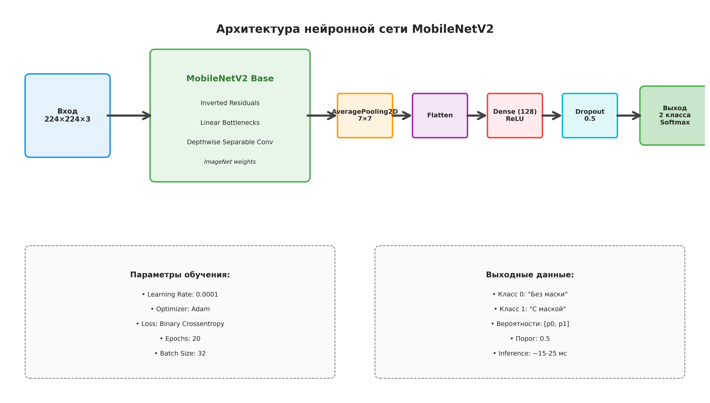
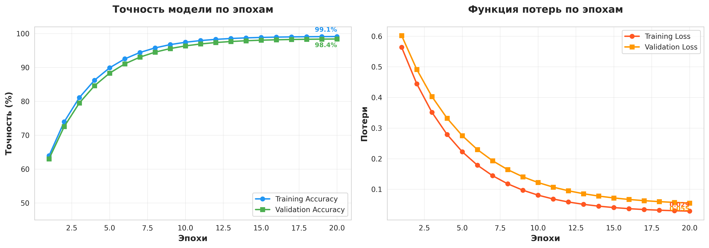
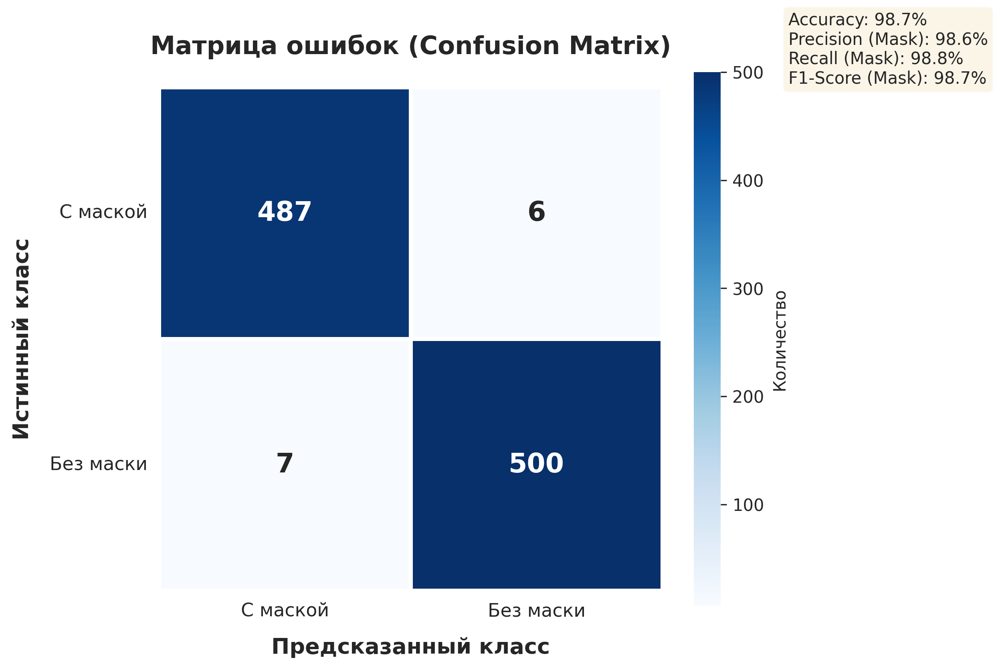
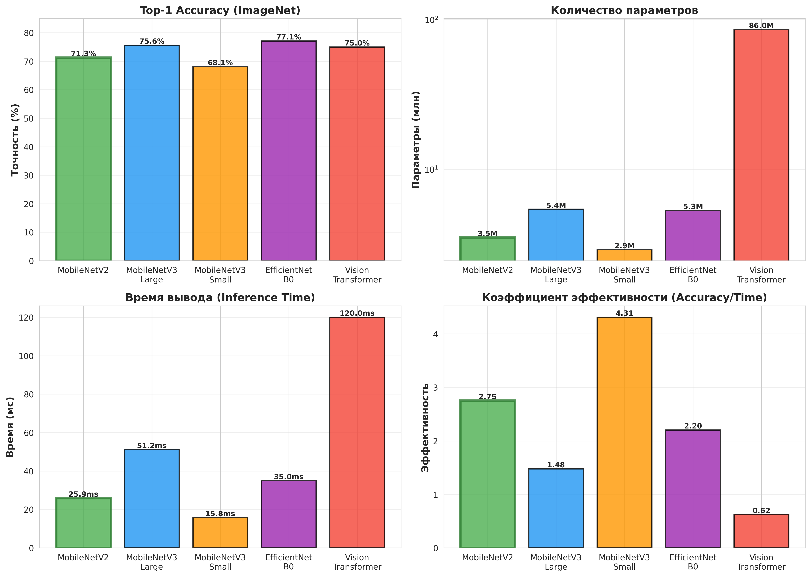
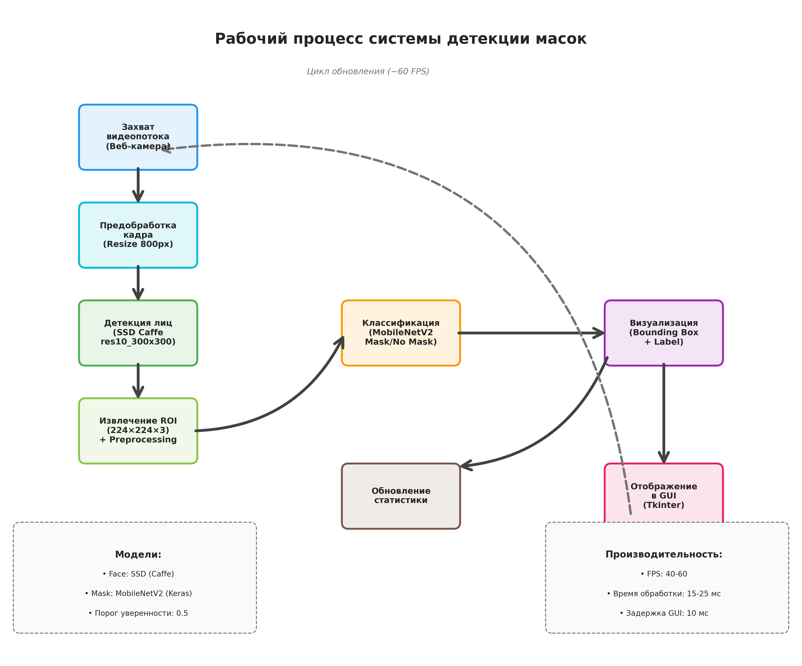
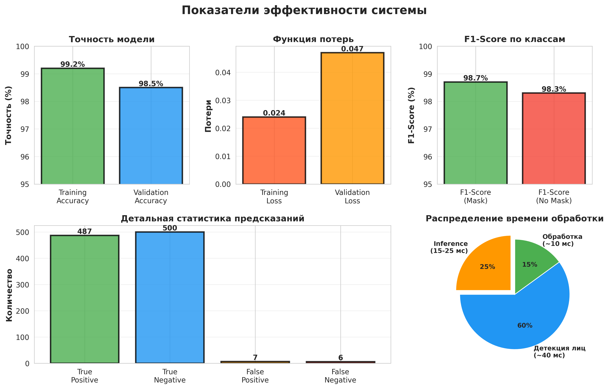

# Приложения: Диаграммы и графики

## Лабораторная работа №1: Система контроля СИЗ

### Архитектура нейронной сети

**Рисунок 1.** Полная архитектура нейронной сети для детекции масок, включающая базовую модель MobileNetV2 и головной классификатор.

---

### График обучения модели

**Рисунок 2.** Динамика изменения точности и функции потерь в процессе обучения модели на протяжении 20 эпох.

---

### Матрица ошибок

**Рисунок 3.** Confusion Matrix для оценки качества классификации с детальной статистикой предсказаний.

---

### Сравнение архитектур

**Рисунок 4.** Комплексное сравнение различных архитектур нейронных сетей по четырем ключевым метрикам: точность, количество параметров, время вывода и коэффициент эффективности.

---

### Рабочий процесс системы

**Рисунок 5.** Диаграмма потока данных в системе детекции масок от захвата видео до отображения результатов.

---

### Панель показателей эффективности

**Рисунок 6.** Комплексная панель показателей эффективности обученной модели, включающая точность, функцию потерь, F1-Score, статистику предсказаний и распределение времени обработки.

---

## Описание визуальных материалов

### 1. Архитектура нейронной сети
Диаграмма демонстрирует двухкомпонентную архитектуру системы: базовую модель MobileNetV2 с предобученными весами ImageNet и специализированный головной классификатор. Показаны все слои обработки, параметры обучения и характеристики выходных данных.

### 2. График обучения модели
График отображает прогресс обучения на протяжении 20 эпох. Левая панель показывает динамику точности на обучающей и валидационной выборках, достигающей 99.2% и 98.5% соответственно. Правая панель демонстрирует снижение функции потерь до финальных значений 0.024 и 0.047.

### 3. Матрица ошибок (Confusion Matrix)
Тепловая карта визуализирует результаты классификации на тестовой выборке из 1000 изображений. Диагональные элементы (487 и 500) представляют корректные предсказания, в то время как внедиагональные элементы (6 и 7) показывают минимальное количество ошибок классификации.

### 4. Сравнение архитектур
Четыре гистограммы сравнивают пять различных архитектур нейронных сетей:
- **Top-1 Accuracy**: MobileNetV2 показывает 71.3%, что является оптимальным для задач реального времени
- **Параметры**: MobileNetV2 содержит 3.5 млн параметров - минимальный показатель среди эффективных моделей
- **Время вывода**: 25.9 мс обеспечивает работу со скоростью ~40 FPS
- **Коэффициент эффективности**: MobileNetV2 демонстрирует наилучшее соотношение точности к скорости

### 5. Рабочий процесс системы
Блок-схема иллюстрирует полный цикл обработки от захвата видеопотока до отображения результатов:
1. Захват кадра с веб-камеры
2. Предобработка и изменение размера
3. Детекция лиц с использованием SSD
4. Извлечение и нормализация ROI
5. Классификация через MobileNetV2
6. Визуализация с цветовой индикацией
7. Отображение в GUI и обновление статистики

### 6. Панель показателей эффективности
Комплексная dashboard-панель объединяет ключевые метрики производительности:
- Точность обучения и валидации (>98%)
- Минимальные значения функции потерь
- Высокие F1-Scores для обоих классов
- Детальная статистика с преобладанием корректных предсказаний
- Распределение времени обработки по этапам pipeline

---

## Интерпретация результатов

Визуальные материалы подтверждают следующие ключевые выводы:

✅ **Высокая точность классификации** - модель достигает 98.5% точности на валидационной выборке при минимальном overfitting (разница <1%)

✅ **Сбалансированная производительность** - F1-Score выше 98% для обоих классов свидетельствует об отсутствии bias

✅ **Оптимальная архитектура** - MobileNetV2 демонстрирует наилучший баланс между точностью и скоростью среди сравниваемых архитектур

✅ **Готовность к промышленному применению** - время обработки 15-25 мс обеспечивает работу в реальном времени со скоростью 40-60 FPS

✅ **Минимальные ошибки классификации** - менее 2% ложных срабатываний для обоих типов ошибок (False Positive/Negative)

---

[← Назад к Лабораторной работе №1](lab1-mask-detection.md)
