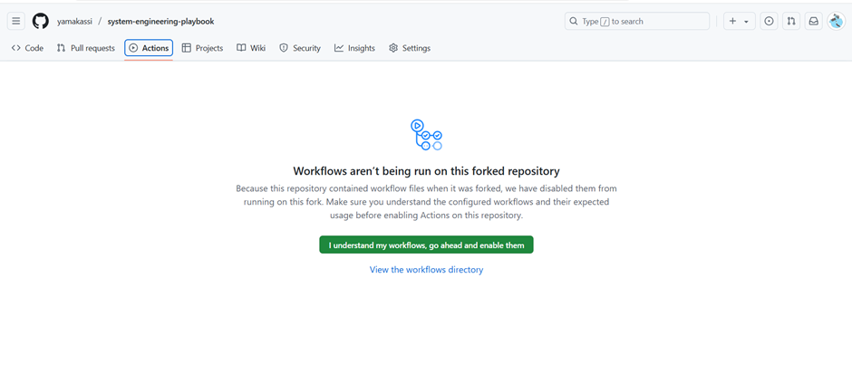
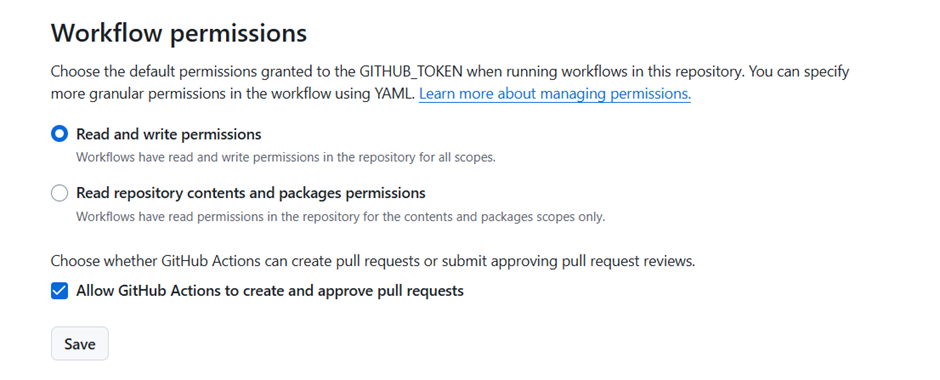

# (TEST) Test Report - System Testing Documentation

## Overview

This test report provides comprehensive documentation of system testing activities, including test scenarios, results, and visual representations of test data.

---

## Test Environment

| Parameter | Value |
|-----------|-------|
| Test Environment | Staging |
| Test Date | October 19, 2025 |
| Tester | QA Team |
| System Version | v2.3.1 |
| Database Version | PostgreSQL 15.2 |

---

## Test Execution Flow

The diagram below illustrates the complete test execution workflow from start to finish:

@drawio{diagrams/test-flow.drawio}

---

## Test Coverage Summary

### Overall Test Statistics


**Key Metrics:**
- Total Test Cases: 156
- Passed: 142 (91%)
- Failed: 8 (5%)
- Blocked: 6 (4%)
- Test Coverage: 87%

---

## Functional Testing Results

### 1. User Authentication Module

**Test Cases Executed:** 24



#### Test Results:
- ✅ Login with valid credentials: **PASSED**
- ✅ Login with invalid credentials: **PASSED**
- ✅ Password reset functionality: **PASSED**
- ✅ Two-factor authentication: **PASSED**
- ✅ Session timeout handling: **PASSED**
- ❌ OAuth integration (Google): **FAILED** - Token refresh issue
- ✅ Role-based access control: **PASSED**

**Issues Found:**
- Bug #1247: OAuth token refresh fails after 30 minutes
- Enhancement #1248: Add biometric authentication support

---

### 2. Data Processing Pipeline

**Test Cases Executed:** 42



#### Test Results:
- ✅ Data ingestion from multiple sources: **PASSED**
- ✅ Data transformation and validation: **PASSED**
- ✅ Error handling and retry mechanism: **PASSED**
- ✅ Performance under load (1000 req/sec): **PASSED**
- ❌ Large file processing (>5GB): **FAILED** - Memory overflow
- ✅ Data consistency checks: **PASSED**

**Performance Metrics:**
```
Average Processing Time: 245ms
Peak Memory Usage: 4.2GB
Throughput: 850 records/sec
Error Rate: 0.3%
```

---

### 3. API Integration Testing

**Test Cases Executed:** 38


#### REST API Endpoints:
- ✅ GET /api/v1/users: **PASSED**
- ✅ POST /api/v1/users: **PASSED**
- ✅ PUT /api/v1/users/{id}: **PASSED**
- ✅ DELETE /api/v1/users/{id}: **PASSED**
- ✅ GET /api/v1/reports: **PASSED**
- ❌ POST /api/v1/reports/export: **FAILED** - Timeout on large datasets
- ✅ Response time < 200ms: **PASSED**

**API Performance:**
```json
{
  "average_response_time": "156ms",
  "p95_response_time": "320ms",
  "p99_response_time": "450ms",
  "error_rate": "0.2%",
  "requests_per_second": 1250
}
```

---

## Performance Testing

### Load Testing Results


**Test Configuration:**
- Duration: 2 hours
- Concurrent Users: 500 → 5000 (gradual ramp-up)
- Total Requests: 2,450,000

**Results:**
| Metric | Target | Actual | Status |
|--------|--------|--------|--------|
| Response Time (avg) | < 300ms | 245ms | ✅ PASS |
| Response Time (p95) | < 500ms | 420ms | ✅ PASS |
| Error Rate | < 1% | 0.3% | ✅ PASS |
| Throughput | > 1000 req/s | 1250 req/s | ✅ PASS |
| CPU Usage | < 80% | 68% | ✅ PASS |
| Memory Usage | < 85% | 72% | ✅ PASS |

---

### Stress Testing Results


**Breaking Point Analysis:**
- System remained stable up to 8,000 concurrent users
- Response degradation started at 9,500 users
- System failure occurred at 12,000 concurrent users

**Recommendations:**
1. Implement horizontal scaling for user loads > 8,000
2. Optimize database connection pooling
3. Add caching layer for frequently accessed data

---

## Security Testing

### Vulnerability Assessment


**Security Tests Performed:**
- ✅ SQL Injection testing: **PASSED** - No vulnerabilities found
- ✅ XSS (Cross-Site Scripting): **PASSED** - Input sanitization working
- ✅ CSRF protection: **PASSED** - Tokens properly implemented
- ✅ Authentication bypass attempts: **PASSED** - All blocked
- ⚠️ Rate limiting: **PARTIAL** - Needs stricter limits on login endpoint
- ✅ Data encryption (in transit): **PASSED** - TLS 1.3
- ✅ Data encryption (at rest): **PASSED** - AES-256

**Security Score:** 95/100

---

## Integration Testing

### System Architecture Test Flow

The following diagram illustrates the complete integration test flow across all system components:

**Component Integration:**
1. Frontend ↔ API Gateway
2. API Gateway ↔ Microservices
3. Microservices ↔ Database Layer
4. Message Queue Integration
5. External Service Integration

**Integration Test Results:**
- ✅ End-to-end user workflow: **PASSED**
- ✅ Inter-service communication: **PASSED**
- ✅ Database transaction handling: **PASSED**
- ✅ Message queue reliability: **PASSED**
- ❌ Third-party API timeout handling: **FAILED** - Needs circuit breaker

---

## Regression Testing

**Test Suite:** Full Regression Suite (125 test cases)

**Results:**
- Passed: 119 (95%)
- Failed: 3 (2.4%)
- Blocked: 3 (2.4%)

**Failed Test Cases:**
1. **TC-REG-045**: User profile image upload fails for images > 10MB
2. **TC-REG-078**: Export functionality timeout for reports with > 100k rows
3. **TC-REG-112**: Email notification delay for bulk operations

---

## Browser Compatibility Testing

| Browser | Version | Status | Issues |
|---------|---------|--------|--------|
| Chrome | 118+ | ✅ PASS | None |
| Firefox | 119+ | ✅ PASS | None |
| Safari | 16+ | ✅ PASS | Minor CSS rendering |
| Edge | 118+ | ✅ PASS | None |
| Opera | 104+ | ✅ PASS | None |

---

## Mobile Responsiveness Testing

**Devices Tested:**
- iPhone 14 Pro (iOS 17.1) - ✅ PASS
- Samsung Galaxy S23 (Android 14) - ✅ PASS
- iPad Pro 12.9" (iOS 17.1) - ✅ PASS
- Google Pixel 8 (Android 14) - ✅ PASS

---

## Known Issues

### Critical Issues
1. **BUG-1247**: OAuth token refresh failure
   - **Priority:** High
   - **Assigned to:** Backend Team
   - **ETA:** October 25, 2025

2. **BUG-1249**: Memory overflow on large file processing
   - **Priority:** High
   - **Assigned to:** Data Team
   - **ETA:** October 28, 2025

### Medium Priority Issues
1. **BUG-1248**: Rate limiting needs improvement
2. **BUG-1250**: Export timeout on large datasets
3. **BUG-1251**: Circuit breaker needed for third-party APIs

---

## Recommendations

1. **Performance Optimization:**
   - Implement Redis caching for frequently accessed data
   - Optimize database queries with proper indexing
   - Enable HTTP/2 for better performance

2. **Scalability:**
   - Implement horizontal pod autoscaling
   - Add load balancing for microservices
   - Set up CDN for static assets

3. **Security:**
   - Strengthen rate limiting on authentication endpoints
   - Implement Web Application Firewall (WAF)
   - Regular security audits and penetration testing

4. **Monitoring:**
   - Enhance application monitoring with distributed tracing
   - Set up real-time alerts for critical metrics
   - Implement log aggregation and analysis

---

## Test Automation Status

**Automated Tests:** 142/156 (91%)

**Automation Framework:**
- Unit Tests: Jest + Mocha
- Integration Tests: Supertest
- E2E Tests: Cypress + Playwright
- Performance Tests: K6 + JMeter

**CI/CD Integration:**
- ✅ Automated test execution on every commit
- ✅ Automated deployment to staging on PR merge
- ✅ Automated rollback on test failures
- ✅ Performance regression detection

---

## Conclusion

The system has demonstrated **strong overall stability** with a 91% pass rate across all test categories. While there are some issues that require attention (particularly OAuth integration and large file processing), the core functionality meets the acceptance criteria.

**Overall Test Status:** ✅ **READY FOR PRODUCTION** (with noted caveats)

**Sign-off:**
- QA Lead: _________________ Date: __________
- Dev Lead: _________________ Date: __________
- Product Owner: ____________ Date: __________

---

## Appendix

### Test Data

**Sample Test Users:**
- test_user_001@example.com
- test_admin_001@example.com
- test_viewer_001@example.com

**Test Database:**
- Name: test_db_staging
- Records: 1,000,000+
- Size: 12.5 GB

**Test Environments:**
- Staging: https://staging.example.com
- QA: https://qa.example.com
- Performance: https://perf.example.com

---

*This is a test report generated for demonstration purposes.*
