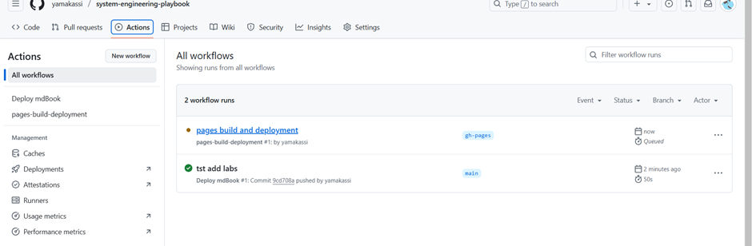

# (ТЕСТ) Тестовый отчет - Документация системного тестирования

## Обзор

Данный тестовый отчет предоставляет комплексную документацию по активностям системного тестирования, включая тестовые сценарии, результаты и визуальное представление тестовых данных.

---

## Схема выполнения тестов

Диаграмма ниже иллюстрирует полный процесс выполнения тестов от начала до конца:

@drawio{diagrams/test-flow.drawio}

---

## Тестовое окружение

| Параметр | Значение |
|-----------|-------|
| Тестовое окружение | Staging |
| Дата тестирования | 19 октября 2025 |
| Тестировщик | Команда QA |
| Версия системы | v2.3.1 |
| Версия БД | PostgreSQL 15.2 |

---

## Сводка по покрытию тестами

### Общая статистика тестирования


**Ключевые метрики:**
- Всего тест-кейсов: 156
- Пройдено: 142 (91%)
- Провалено: 8 (5%)
- Заблокировано: 6 (4%)
- Покрытие тестами: 87%

---

## Результаты функционального тестирования

### 1. Модуль аутентификации пользователей

**Выполнено тест-кейсов:** 24


#### Результаты тестирования:
- ✅ Вход с корректными учетными данными: **ПРОЙДЕН**
- ✅ Вход с некорректными учетными данными: **ПРОЙДЕН**
- ✅ Функционал восстановления пароля: **ПРОЙДЕН**
- ✅ Двухфакторная аутентификация: **ПРОЙДЕН**
- ✅ Обработка истечения сессии: **ПРОЙДЕН**
- ❌ OAuth интеграция (Google): **ПРОВАЛЕН** - Проблема с обновлением токена
- ✅ Контроль доступа на основе ролей: **ПРОЙДЕН**

**Обнаруженные проблемы:**
- Баг #1247: Ошибка обновления OAuth токена через 30 минут
- Улучшение #1248: Добавить поддержку биометрической аутентификации

---

### 2. Конвейер обработки данных

**Выполнено тест-кейсов:** 42


#### Результаты тестирования:
- ✅ Получение данных из множественных источников: **ПРОЙДЕН**
- ✅ Трансформация и валидация данных: **ПРОЙДЕН**
- ✅ Обработка ошибок и механизм повторных попыток: **ПРОЙДЕН**
- ✅ Производительность под нагрузкой (1000 запр/сек): **ПРОЙДЕН**
- ❌ Обработка больших файлов (>5ГБ): **ПРОВАЛЕН** - Переполнение памяти
- ✅ Проверка консистентности данных: **ПРОЙДЕН**

**Метрики производительности:**
```
Среднее время обработки: 245мс
Пиковое использование памяти: 4.2ГБ
Пропускная способность: 850 записей/сек
Процент ошибок: 0.3%
```

---

### 3. Тестирование интеграции API

**Выполнено тест-кейсов:** 38


#### REST API эндпоинты:
- ✅ GET /api/v1/users: **ПРОЙДЕН**
- ✅ POST /api/v1/users: **ПРОЙДЕН**
- ✅ PUT /api/v1/users/{id}: **ПРОЙДЕН**
- ✅ DELETE /api/v1/users/{id}: **ПРОЙДЕН**
- ✅ GET /api/v1/reports: **ПРОЙДЕН**
- ❌ POST /api/v1/reports/export: **ПРОВАЛЕН** - Таймаут на больших наборах данных
- ✅ Время отклика < 200мс: **ПРОЙДЕН**

**Производительность API:**
```json
{
  "среднее_время_отклика": "156мс",
  "p95_время_отклика": "320мс",
  "p99_время_отклика": "450мс",
  "процент_ошибок": "0.2%",
  "запросов_в_секунду": 1250
}
```

---

## Нагрузочное тестирование

### Результаты нагрузочного тестирования


**Конфигурация теста:**
- Длительность: 2 часа
- Одновременные пользователи: 500 → 5000 (постепенное увеличение)
- Всего запросов: 2,450,000

**Результаты:**
| Метрика | Цель | Фактически | Статус |
|--------|--------|--------|--------|
| Время отклика (среднее) | < 300мс | 245мс | ✅ ПРОЙДЕН |
| Время отклика (p95) | < 500мс | 420мс | ✅ ПРОЙДЕН |
| Процент ошибок | < 1% | 0.3% | ✅ ПРОЙДЕН |
| Пропускная способность | > 1000 запр/с | 1250 запр/с | ✅ ПРОЙДЕН |
| Использование CPU | < 80% | 68% | ✅ ПРОЙДЕН |
| Использование памяти | < 85% | 72% | ✅ ПРОЙДЕН |

---

### Результаты стресс-тестирования



**Анализ точки отказа:**
- Система оставалась стабильной до 8,000 одновременных пользователей
- Деградация отклика началась при 9,500 пользователях
- Отказ системы произошел при 12,000 одновременных пользователях

**Рекомендации:**
1. Внедрить горизонтальное масштабирование для нагрузки > 8,000 пользователей
2. Оптимизировать пулинг соединений с БД
3. Добавить слой кеширования для часто запрашиваемых данных

---

## Тестирование безопасности

### Оценка уязвимостей


**Выполненные тесты безопасности:**
- ✅ Тестирование SQL инъекций: **ПРОЙДЕН** - Уязвимостей не обнаружено
- ✅ XSS (Межсайтовый скриптинг): **ПРОЙДЕН** - Санитизация работает
- ✅ CSRF защита: **ПРОЙДЕН** - Токены корректно реализованы
- ✅ Попытки обхода аутентификации: **ПРОЙДЕН** - Все заблокированы
- ⚠️ Ограничение частоты запросов: **ЧАСТИЧНО** - Требуются более строгие лимиты на эндпоинт входа
- ✅ Шифрование данных (при передаче): **ПРОЙДЕН** - TLS 1.3
- ✅ Шифрование данных (в покое): **ПРОЙДЕН** - AES-256

**Оценка безопасности:** 95/100

---

## Интеграционное тестирование

### Схема тестирования системной архитектуры

Следующая диаграмма иллюстрирует полный поток интеграционных тестов всех системных компонентов:

**Интеграция компонентов:**
1. Frontend ↔ API Gateway
2. API Gateway ↔ Микросервисы
3. Микросервисы ↔ Слой базы данных
4. Интеграция очереди сообщений
5. Интеграция внешних сервисов

**Результаты интеграционного тестирования:**
- ✅ Сквозной пользовательский workflow: **ПРОЙДЕН**
- ✅ Взаимодействие между сервисами: **ПРОЙДЕН**
- ✅ Обработка транзакций БД: **ПРОЙДЕН**
- ✅ Надежность очереди сообщений: **ПРОЙДЕН**
- ❌ Обработка таймаутов сторонних API: **ПРОВАЛЕН** - Требуется circuit breaker

---

## Регрессионное тестирование

**Набор тестов:** Полный набор регрессионных тестов (125 тест-кейсов)

**Результаты:**
- Пройдено: 119 (95%)
- Провалено: 3 (2.4%)
- Заблокировано: 3 (2.4%)

**Проваленные тест-кейсы:**
1. **TC-REG-045**: Загрузка изображения профиля падает для изображений > 10МБ
2. **TC-REG-078**: Таймаут функционала экспорта для отчетов с > 100к строк
3. **TC-REG-112**: Задержка email уведомлений для массовых операций

---

## Тестирование совместимости с браузерами

| Браузер | Версия | Статус | Проблемы |
|---------|---------|--------|--------|
| Chrome | 118+ | ✅ ПРОЙДЕН | Нет |
| Firefox | 119+ | ✅ ПРОЙДЕН | Нет |
| Safari | 16+ | ✅ ПРОЙДЕН | Мелкие проблемы с CSS |
| Edge | 118+ | ✅ ПРОЙДЕН | Нет |
| Opera | 104+ | ✅ ПРОЙДЕН | Нет |

---

## Тестирование мобильной адаптивности

**Протестированные устройства:**
- iPhone 14 Pro (iOS 17.1) - ✅ ПРОЙДЕН
- Samsung Galaxy S23 (Android 14) - ✅ ПРОЙДЕН
- iPad Pro 12.9" (iOS 17.1) - ✅ ПРОЙДЕН
- Google Pixel 8 (Android 14) - ✅ ПРОЙДЕН

---

## Известные проблемы

### Критические проблемы
1. **БАГ-1247**: Ошибка обновления OAuth токена
   - **Приоритет:** Высокий
   - **Назначено:** Backend команде
   - **Срок:** 25 октября 2025

2. **БАГ-1249**: Переполнение памяти при обработке больших файлов
   - **Приоритет:** Высокий
   - **Назначено:** Команде данных
   - **Срок:** 28 октября 2025

### Проблемы среднего приоритета
1. **БАГ-1248**: Требуется улучшение ограничения частоты запросов
2. **БАГ-1250**: Таймаут экспорта на больших наборах данных
3. **БАГ-1251**: Требуется circuit breaker для сторонних API

---

## Рекомендации

1. **Оптимизация производительности:**
   - Внедрить Redis кеширование для часто запрашиваемых данных
   - Оптимизировать запросы к БД с правильными индексами
   - Включить HTTP/2 для лучшей производительности

2. **Масштабируемость:**
   - Внедрить автомасштабирование подов
   - Добавить балансировку нагрузки для микросервисов
   - Настроить CDN для статических ресурсов

3. **Безопасность:**
   - Усилить ограничение частоты запросов на эндпоинтах аутентификации
   - Внедрить Web Application Firewall (WAF)
   - Регулярные аудиты безопасности и пентесты

4. **Мониторинг:**
   - Улучшить мониторинг приложения с распределенной трассировкой
   - Настроить оповещения в реальном времени для критических метрик
   - Внедрить агрегацию и анализ логов

---

## Статус автоматизации тестов

**Автоматизированные тесты:** 142/156 (91%)

**Фреймворк автоматизации:**
- Модульные тесты: Jest + Mocha
- Интеграционные тесты: Supertest
- E2E тесты: Cypress + Playwright
- Нагрузочные тесты: K6 + JMeter

**Интеграция CI/CD:**
- ✅ Автоматическое выполнение тестов при каждом коммите
- ✅ Автоматический деплой в staging при мердже PR
- ✅ Автоматический откат при провале тестов
- ✅ Обнаружение регрессии производительности

---

## Заключение

Система продемонстрировала **высокую общую стабильность** с уровнем прохождения тестов 91% по всем категориям. Хотя есть несколько проблем, требующих внимания (в частности OAuth интеграция и обработка больших файлов), основной функционал соответствует критериям приемки.

**Общий статус тестирования:** ✅ **ГОТОВО К ПРОДАКШЕНУ** (с отмеченными оговорками)

**Подтверждение:**
- Руководитель QA: _________________ Дата: __________
- Руководитель разработки: _________________ Дата: __________
- Владелец продукта: ____________ Дата: __________

---

## Приложение

### Тестовые данные

**Примеры тестовых пользователей:**
- test_user_001@example.com
- test_admin_001@example.com
- test_viewer_001@example.com

**Тестовая база данных:**
- Имя: test_db_staging
- Записей: 1,000,000+
- Размер: 12.5 ГБ

**Тестовые окружения:**
- Staging: https://staging.example.com
- QA: https://qa.example.com
- Performance: https://perf.example.com

---

*Это тестовый отчет, созданный в демонстрационных целях.*
